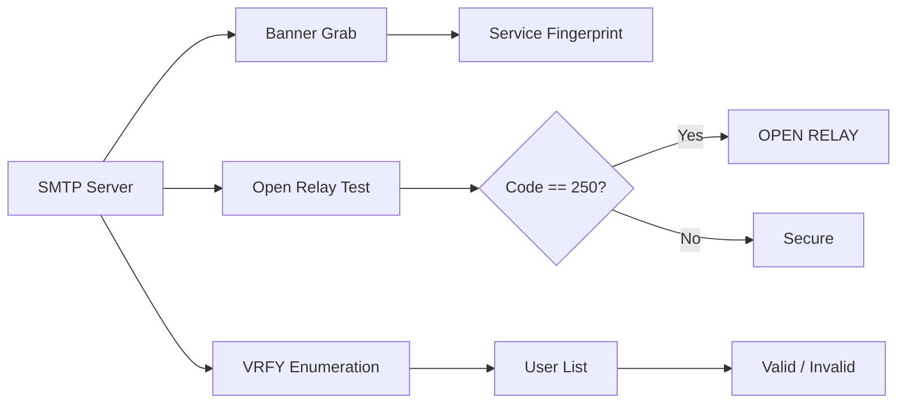

# MailSnitch

SMTP reconnaissance tool. Banner grab, open relay testing, VRFY enumeration. Nothing fancy.

## How it works



## Usage

```bash
# Banner grab
python3 mailsnitch.py -t mail.example.com --banner

# Open relay test
python3 mailsnitch.py -t mail.example.com --relay-test

# VRFY a single user
python3 mailsnitch.py -t mail.example.com --vrfy root

# Enumerate users from wordlist
python3 mailsnitch.py -t mail.example.com --enumerate users.txt
```

## Checks Performed

| Test | What it does | Detection |
|------|-------------|-----------|
| Banner grab | Connect and read SMTP banner | Identifies MTA software and version |
| Open relay | Attempt to relay mail to external domain | 250 = open, 550/5xx = secure |
| VRFY | Verify a single username | 250 = exists, 550 = not found |
| Enumerate | VRFY multiple users from wordlist | Returns only confirmed (250/252) |

## Project Structure

```
MailSnitch/
├── mailsnitch.py
├── README.md
├── LICENSE
├── requirements.txt
├── tests/
│   └── test_mailsnitch.py
└── docs/
    └── engineering-report.md
```

## License

MIT
